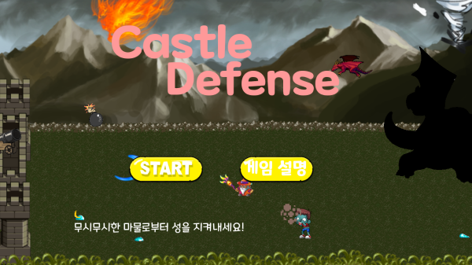
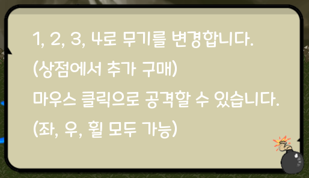
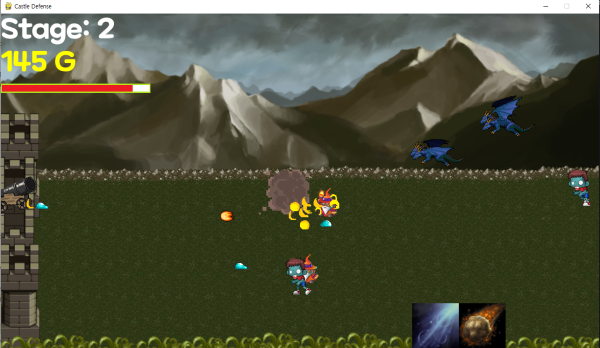
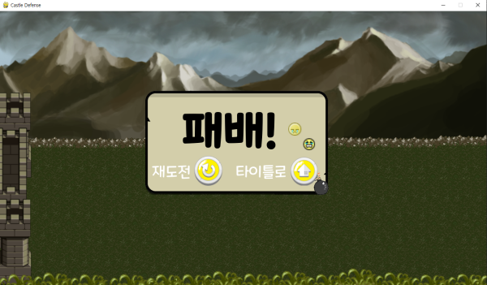
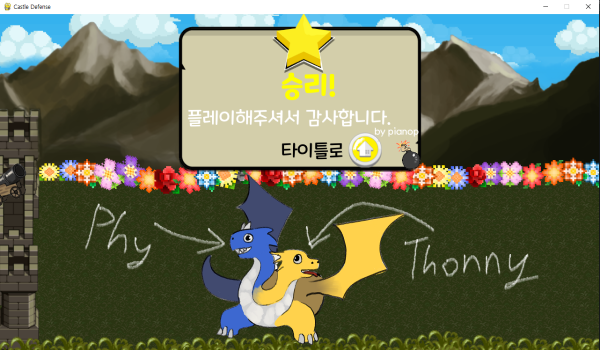
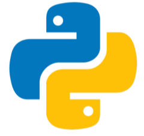

# Open Source Software project  

## :bookmark:**목차**
- [Title](#flags-title)
- [사용 언어](#computer-사용-언어)
- [게임 설명](#pencil2-게임-설명)
- [인게임](#video_game-게임-플레이-영상)
- [실행 방법](#books-실행하는-방법)
- [클리어 (스포일러 주의)](#tada-클리어시)
- [라이센스](#mortar_board-라이센스)
  

## :flags: Title

  

**제목: Castle Defense**
  

## :computer: 사용 언어

  

**Python(3.9.12)**

pygame 라이브러리 사용  

  

## :pencil2: 게임 설명

  

총 3개의 스테이지로 이루어져있고 마지막 스테이지에는 보스가 등장합니다.
스테이지 사이의 상점에서 무기를 구매하거나 성을 수리할 수 있습니다.  

보스는 아주 사악하고 무시무시하게 생겼으니 마음의 준비를 하시길 바랍니다!  

  

## :video_game: 게임 플레이, 영상

  

  

패배시 해당 스테이지에서 재도전 하거나 타이틀로 돌아갈 수 있습니다.  

보스의 패턴들은 상점에서 구매한 무기들로 파훼할 수 있으니 참고해주세요!  

:movie_camera: [플레이 영상](https://youtu.be/4XVCX4IJ29g) (스포일러 주의)
  

## :books: 실행하는 방법

CastleDefense/CastleDefense.exe 를 실행시켜주세요!
    

## 스포일러 주의!!  

#### 게임을 클리어 하고 보시는 걸 추천드립니다. (아래로 내리면 나옵니다.)
                                    

## :tada: 클리어시

  

  

해당 용은 파이썬의 로고를 모티브로 제 친구가 그려줬습니다.  (보스로 등장합니다.)

작가님께서 왼쪽의 파란 머리는 Phy이고 오른쪽의 노랑이는 Thonny 그리고 둘이 합쳐서 Phythonny(파이써니)로 이름을 지어주셨습니다!  
  

읽어주셔서 감사합니다.

  

       

## :mortar_board: 라이센스

#### 파생물(그림들)은 모두 원본의 라이선스를 따릅니다.  

#### 코드와 그 외의 라이선스는 MIT를 따릅니다.  

#### 자세한 참조 내용은 reference/reference.md를 확인해주세요!  
